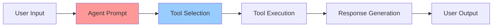
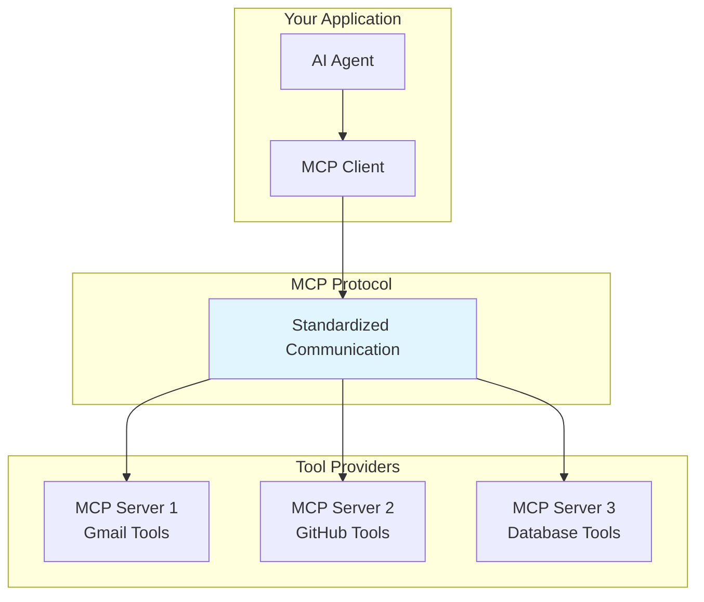
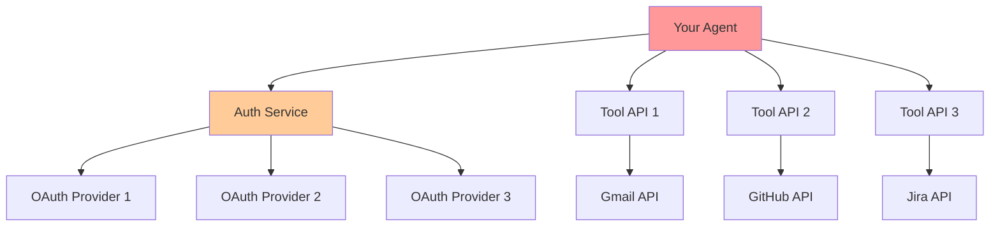
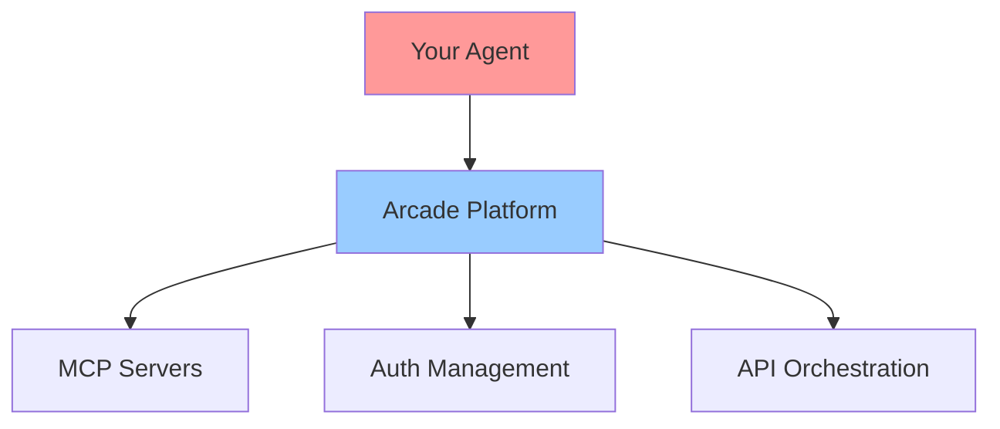
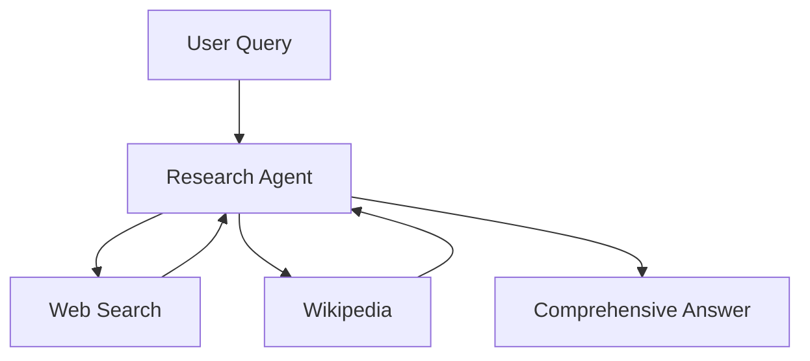
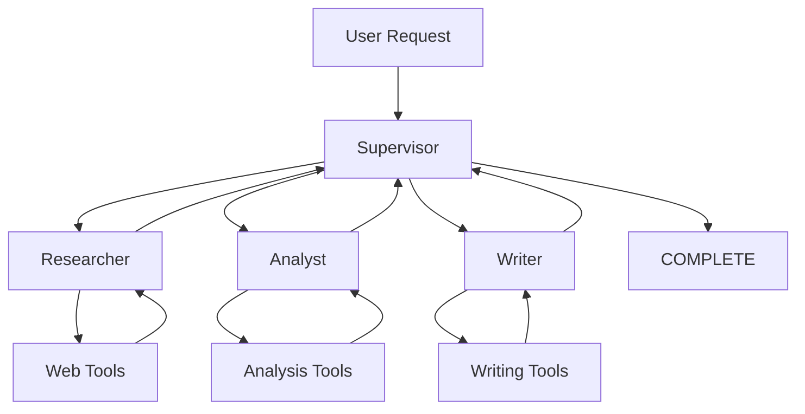

# AI Agent Building Workshop: YAML + Arcade Integration

## Workshop Overview

**Duration**: 3-4 hours  
**Level**: Intermediate to Advanced  
**Prerequisites**: Basic Python knowledge, understanding of APIs and LLMs  

### Learning Objectives

By the end of this workshop, participants will understand:
1. **The fundamental principle**: AI agents are just **prompts + tools**
2. How **Arcade abstracts complexity** (auth, tool calling, MCP hosting)
3. The **Model Context Protocol (MCP)** and its role in agent architectures
4. How to build **production-ready agents** with zero infrastructure setup
5. **Hierarchical agent patterns** for complex workflows

---

## Part 1: Foundation - What is an AI Agent?

### The Core Principle: Agents = Prompts + Tools



**Traditional Complexity:**
- Set up authentication flows
- Manage API credentials
- Handle tool calling protocols  
- Deploy and maintain servers
- Build MCP servers for tool integration

**With Arcade:**
```yaml
agents:
  assistant:
    instructions: |
      You are a helpful assistant. Use available tools to help users.
    tools:
      - Gmail      # Arcade handles auth, API calls, MCP server
      - GitHub     # Just declare what you need!
      - Jira
```

### Why This Matters

**Before Arcade + MCP:**
```python
# 200+ lines of code for a simple Gmail agent
class GmailAgent:
    def __init__(self):
        self.oauth_flow = OAuth2Flow()  # Complex auth setup
        self.gmail_client = build('gmail', 'v1', credentials=creds)
        self.tool_schema = {...}        # Manual tool definitions
        
    def authenticate(self):
        # 50 lines of OAuth flow
        
    def send_email(self, to, subject, body):
        # 30 lines of Gmail API calls with error handling
```

**With Arcade + MCP:**
```yaml
agents:
  gmail_assistant:
    instructions: Send and manage emails professionally
    tools: [Gmail]
```
*That's it. 4 lines.*

### Deterministic vs Non-Deterministic Agent Workflows

Understanding workflow types is crucial for designing effective agent systems. Agents can operate in different modes depending on business requirements:

#### Deterministic Workflows
**Definition**: Predefined, rule-based sequences where each input produces a predictable, consistent output.

**Characteristics:**
- Follow explicit business rules and logic
- Produce repeatable, auditable results
- Ideal for compliance and regulatory processes
- Minimal variability in responses

**Example - Inventory Management:**

Your existing deterministic inventory system already monitors levels and triggers alerts. The AI agent provides intelligent decision-making:

```yaml
# Simple AI agent called by your existing inventory system
agents:
  inventory_purchasing_agent:
    instructions: |
      When your inventory system detects low stock, I analyze:
      - Current supplier performance and pricing
      - Seasonal demand patterns
      - Budget constraints and cash flow
      - Market conditions and trends
      
      Make intelligent purchasing recommendations with quantities, 
      timing, and vendor selection.
    tools: [SupplierAPI, MarketData, FinanceAPI]
```

**Integration**: Your inventory system calls this agent when stock < threshold.

#### Non-Deterministic Workflows  
**Definition**: Adaptive, context-aware processes that can produce variable outcomes based on AI reasoning and environmental factors.

**Characteristics:**
- Use AI reasoning and machine learning
- Adapt to context and historical patterns
- Handle ambiguity and complex decision-making
- Learn and improve over time

**Example - Customer Support:**
```yaml
# Non-deterministic response: AI analyzes context and decides approach
agents:
  support_agent:
    instructions: |
      Analyze customer inquiries considering:
      - Customer history and sentiment
      - Product knowledge base
      - Current system status
      - Escalation protocols
      Craft personalized responses and determine next actions.
    tools: [CRM, KnowledgeBase, TicketSystem]
```

#### Hybrid Workflows: The Power Combination
**Most production systems benefit from combining both approaches:**

**Pattern**: Existing deterministic system → Calls simple AI agent → Takes intelligent action

```yaml
# Simple AI agent that your existing systems call
agents:
  purchasing_decision_agent:
    instructions: |
      When called with inventory data and constraints, provide intelligent 
      purchasing recommendations by analyzing:
      - Seasonal trends and demand forecasts
      - Supplier performance and competitive pricing
      - Current budget constraints and cash flow
      - Market conditions and supply chain status
      
      Return specific recommendations: vendor, quantity, timing, terms.
    tools: [SupplierAPI, MarketData, FinanceAPI]
```

**Integration**: Your existing inventory management system calls this agent via API when it detects low stock levels.

#### Ambient Agents: Always-On Intelligence
**Ambient agents** provide intelligent analysis when called by your existing monitoring systems.

**Key Features:**
- **Context-aware**: Analyze multiple data streams when triggered
- **Intelligent**: Make smart decisions about escalation and response
- **Integrated**: Called by your existing monitoring infrastructure
- **Simple**: Just YAML configuration, no complex monitoring setup

**Example - IT Operations:**

Your existing monitoring system (Datadog, New Relic, etc.) already tracks metrics and triggers alerts. The AI agent provides intelligent incident response:

```yaml
agents:
  ops_incident_agent:
    instructions: |
      When called with system alerts and metrics, I analyze:
      - Current performance data and trends
      - Historical incident patterns
      - System dependencies and impact scope
      - Team availability and expertise
      
      Provide intelligent incident response: severity assessment,
      recommended actions, escalation decisions, and communication plan.
    tools: [MonitoringAPI, PagerDuty, Slack, IncidentDB]
```

**Integration**: Your monitoring system calls this agent when alerts are triggered.

### Simple Integration Patterns

#### Pattern 1: Event-Driven Intelligence
Your existing payment system already flags suspicious transactions. Add AI analysis:

```yaml
agents:
  fraud_analysis_agent:
    instructions: |
      When called with flagged transaction data, analyze fraud probability using:
      - User behavioral patterns and history
      - Merchant reputation and risk indicators  
      - Geographic and timing anomalies
      - Transaction pattern analysis
      
      Return recommendation: APPROVE, DECLINE, or REQUEST_VERIFICATION
      with confidence score and reasoning.
    tools: [TransactionDB, UserProfileAPI, MerchantAPI]
```
**Integration**: Payment system calls agent for transactions > $10K or unusual patterns

#### Pattern 2: Scheduled Intelligence  
Your CRM already tracks customer data. Add proactive churn prediction:

```yaml
agents:
  customer_health_agent:
    instructions: |
      When called with customer data, identify churn risk by analyzing:
      - Engagement patterns and usage trends
      - Support ticket sentiment and frequency
      - Feature adoption and satisfaction scores
      - Comparative behavior vs successful customers
      
      Recommend personalized retention strategies and outreach timing.
    tools: [CRM, SupportDB, AnalyticsAPI]
```
**Integration**: Scheduled job calls this agent every 4 hours with customer data

#### Pattern 3: Human-AI Collaboration  
Your loan processing system handles verification and scoring. Add AI insights:

```yaml
agents:
  loan_insights_agent:
    instructions: |
      When called with loan application data (after verification), analyze:
      - Soft factors in application narrative
      - Cross-reference with market conditions
      - Assess risk factors not captured in standard scoring
      - Generate confidence-scored recommendation
      
      If confidence < 85%, flag for human review with specific concerns.
    tools: [CreditAPI, MarketData, RiskAssessment]
```
**Integration**: Loan system calls agent after completing deterministic checks

### Why This Matters for Agent Design

1. **Business Process Integration**: Agents must fit into existing workflows, not replace them entirely
2. **Auditability**: Deterministic components provide clear audit trails
3. **Flexibility**: Non-deterministic components handle edge cases and complexity
4. **Efficiency**: Ambient agents reduce response times and manual monitoring
5. **Scalability**: Hybrid approaches can handle both routine and exceptional cases

---

## Part 2: Understanding MCP (Model Context Protocol)

### What is MCP?

The **Model Context Protocol** is an open standard that defines how AI applications connect to external tools and data sources. Think of it as "USB-C for AI."

Reference: [MCP Documentation](https://modelcontextprotocol.io/docs/getting-started/intro)

### MCP Architecture



### Key MCP Benefits

1. **Standardization**: One protocol for all tools
2. **Interoperability**: Tools work across different AI applications
3. **Security**: Proper authentication and authorization patterns
4. **Discovery**: Automatic tool capability discovery

### MCP in Our System

```python
# MCP handles the complex protocol details
from langchain_arcade import ToolManager

# This single line gives you:
# - MCP client setup
# - Server discovery  
# - Tool registration
# - Protocol handling
tool_manager = ToolManager(arcade_client)
tools = tool_manager.get_tools_for_toolkit("Gmail")
```

---

## Part 3: Arcade Integration Deep Dive

### What Arcade Provides

**Arcade.dev** is a platform that handles the infrastructure complexity of AI agent tooling:

1. **Authentication Management**: OAuth flows, token refresh, credential storage
2. **Tool Hosting**: MCP servers for 100+ integrations
3. **API Orchestration**: Rate limiting, retry logic, error handling  
4. **Security**: Proper permission scoping and user isolation

### Architecture Comparison

**Without Arcade:**


**With Arcade:**


### Code Comparison

**Traditional Setup (Gmail only):**
```python
import os
import pickle
from google.auth.transport.requests import Request
from google_auth_oauthlib.flow import InstalledAppFlow
from googleapiclient.discovery import build

SCOPES = ['https://www.googleapis.com/auth/gmail.readonly']

def authenticate_gmail():
    creds = None
    if os.path.exists('token.pickle'):
        with open('token.pickle', 'rb') as token:
            creds = pickle.load(token)
    
    if not creds or not creds.valid:
        if creds and creds.expired and creds.refresh_token:
            creds.refresh(Request())
        else:
            flow = InstalledAppFlow.from_client_secrets_file(
                'credentials.json', SCOPES)
            creds = flow.run_local_server(port=0)
        
        with open('token.pickle', 'wb') as token:
            pickle.dump(creds, token)
    
    service = build('gmail', 'v1', credentials=creds)
    return service

class GmailTool:
    def __init__(self):
        self.service = authenticate_gmail()
    
    def send_email(self, to: str, subject: str, body: str):
        # 30+ lines of Gmail API complexity
        pass
```

**With Arcade:**
```python
from arcadepy import Arcade
from langchain_arcade import ToolManager

arcade = Arcade(api_key="your_key")
tool_manager = ToolManager(arcade)
gmail_tools = tool_manager.get_tools_for_toolkit("Gmail")

# That's it! Auth, API calls, error handling all handled.
```

---

## Part 4: Agent Patterns and Architecture

### Pattern 1: Single Agent

**Use Case**: Simple question answering, single-domain tasks

```yaml
agents:
  research_assistant:
    instructions: |
      You are a research assistant. Search for information and provide 
      comprehensive answers with citations.
    tools:
      - WebSearch
      - Wikipedia
```

**Mermaid Visualization:**


### Pattern 2: Supervisor with Specialists

**Use Case**: Multi-step workflows requiring different specializations

```yaml
agents:
  researcher:
    instructions: Find information from web sources
    tools: [WebSearch, Wikipedia]
  
  analyst:  
    instructions: Analyze data and create insights
    tools: [Calculator, DataAnalysis]
    
  writer:
    instructions: Write professional documents
    tools: [GoogleDocs, Grammarly]
  
  supervisor:
    instructions: |
      Coordinate the team:
      - researcher: for finding information
      - analyst: for data analysis  
      - writer: for document creation
      - COMPLETE: when task is finished

routing:
  supervisor: supervisor
```

**Mermaid Visualization:**


### Pattern 3: Hierarchical Teams

**Use Case**: Enterprise workflows spanning multiple departments

```yaml
agents:
  # Sales Department
  crm_agent:
    instructions: Manage CRM contacts and deals
    tools: [Salesforce, HubSpot]
    
  outreach_agent:
    instructions: Handle email outreach and follow-ups  
    tools: [Gmail, Outreach]
  
  sales_supervisor:
    instructions: |
      Manage sales operations:
      - crm_agent: for CRM tasks
      - outreach_agent: for email campaigns
      - COMPLETE: when sales task done
  
  # Marketing Department  
  social_agent:
    instructions: Manage social media presence
    tools: [Twitter, LinkedIn, Facebook]
    
  content_agent:
    instructions: Create marketing content
    tools: [Canva, GoogleDocs, WordPress]
    
  marketing_supervisor:
    instructions: |
      Coordinate marketing:
      - social_agent: for social media
      - content_agent: for content creation
      - COMPLETE: when marketing done
  
  # Master Supervisor
  master_supervisor:
    instructions: |
      Route to departments:
      - sales_supervisor: for sales tasks
      - marketing_supervisor: for marketing tasks  
      - COMPLETE: when everything done

routing:
  supervisor: master_supervisor
  max_iterations: 25
```

---

## Part 5: Hands-On Workshop Experience

### Phase 1: Explore Sample Agents (20 minutes)

**Goal**: Understand different agent patterns by running existing examples

The workshop includes pre-built sample agents in the `agents/` directory:

#### **Simple Agents**
```bash
# Single Gmail assistant - perfect starting point
python main.py agents/simple-agents/simple-agent-example.yaml "Check my recent emails"
python main.py agents/simple-agents/simple-agent-example.yaml "Search for emails about the project meeting"
```

#### **Single Supervisor Systems**  
```bash
# Personal assistant: Email + Calendar + Documents with smart routing
python main.py agents/single-supervisor-agents/supervisor-personal-assistant.yaml "Check my emails and schedule a meeting for tomorrow"
python main.py agents/single-supervisor-agents/supervisor-personal-assistant.yaml "Create a document and share it with the team"

# IT helpdesk: Ticket management + Knowledge base + Escalation  
python main.py agents/single-supervisor-agents/supervisor-it-helpdesk.yaml "What's the status of ticket HELP-123?"
python main.py agents/single-supervisor-agents/supervisor-it-helpdesk.yaml "My laptop won't connect to WiFi, create a ticket"
```

#### **Hierarchical Multi-Department Systems**
```bash
# Enterprise system: Personal + Development + Knowledge departments
python main.py agents/hierarchical-multi-supervisor-agents/hierarchical-agent-teams-example.yaml "Check my calendar and create a GitHub issue for the bug"
python main.py agents/hierarchical-multi-supervisor-agents/hierarchical-agent-teams-example.yaml "Create a Google doc about the project and email it to the team"
```

**Experiment with different requests:**
- Try the same request on different agent systems
- Use `--debug` to see routing decisions and tool usage
- Notice how complexity scales from simple to hierarchical

### Phase 2: Design Your Own Agents (25 minutes)

**Goal**: Design custom agents for your specific use case on paper

#### **Design Exercise: Paper Planning**

**Step 1**: Identify Your Use Case (5 minutes)
- What workflow in your organization needs intelligence?
- What deterministic systems already exist?
- Where would AI decision-making add value?

**Step 2**: Sketch Your Agent Architecture (10 minutes)
```
Example Template:

Your Existing System: ________________
↓ (calls when?)
AI Agent: _________________________
Tools Needed: ____________________
Expected Output: __________________

OR for multi-agent:

User Request → Supervisor Agent
                ↓
           ┌──────┼──────┐
    Agent 1   Agent 2   Agent 3
    Tools: __ Tools: __ Tools: __
```

**Step 3**: Define Agent Instructions (10 minutes)
- Write clear instructions for each agent
- Specify when to use each tool
- Define completion criteria
- Plan integration points with existing systems

#### **Common Use Case Patterns to Consider:**

**Customer Operations:**
- Support ticket routing and resolution
- Customer health monitoring and outreach
- Order processing with intelligent recommendations

**Business Operations:**
- Financial analysis and reporting
- HR recruiting and onboarding workflows  
- Supply chain and inventory optimization

**Technical Operations:**
- Code review and deployment workflows
- Incident response and system monitoring
- Documentation generation and maintenance

### Phase 3: Build Your Custom Agents (25 minutes)

**Goal**: Implement your paper design in YAML

#### **Implementation Steps:**

**Step 1**: Create Your YAML File (10 minutes)
```yaml
# my-custom-agent.yaml
agents:
  your_agent_name:
    instructions: |
      [Your detailed instructions from paper design]
      
      When called by [your existing system], I analyze:
      - [Factor 1]
      - [Factor 2] 
      - [Factor 3]
      
      Then provide specific recommendations for [outcome].
    tools:
      - [Tool1]
      - [Tool2]
      - [Tool3]
      
  # Add more agents if using multi-agent pattern
  supervisor: # (if needed)
    instructions: |
      Route requests to appropriate specialists:
      - your_agent_name: for [specific use case]
      - COMPLETE: when [completion criteria]

routing: # (if using supervisor pattern)
  supervisor: supervisor
```

**Step 2**: Test Your Agent (10 minutes)
```bash
python main.py my-custom-agent.yaml "Your test request here"

# Use debug mode to understand behavior
python main.py --debug my-custom-agent.yaml "Your test request"
```

**Step 3**: Iterate and Improve (5 minutes)
- Refine instructions based on test results
- Adjust tool selection if needed  
- Test with different request types
- Consider edge cases and error handling

#### **Integration Planning**
While building your agent, consider how it will integrate with your existing systems:

```bash
# Your existing system would make API calls like:
curl -X POST http://your-agent-api/process \
  -H "Content-Type: application/json" \
  -d '{"request": "Your system data and context"}'
```

**Example Integration Points:**
- Webhook endpoints from monitoring systems
- Scheduled jobs calling agents with batch data
- Event-driven calls from business applications
- API integrations in existing workflows

---

## Part 6: Advanced Topics

### OAuth and Authorization Flow

The system handles OAuth gracefully:

```bash
$ python main.py gmail-agent.yaml "Send an email to john@company.com"

🔒 Authorization required: https://accounts.google.com/oauth/authorize?...
Please complete authorization in your browser, then type 'continue'

> continue
✓ Authorization complete! Retrying your request...
📧 Email sent successfully to john@company.com
```

### Debug Mode

Use `--debug` to understand system behavior:

```bash  
python main.py --debug enterprise-system.yaml "Hire a new designer"

[DEBUG] Loading config: enterprise-system.yaml
[DEBUG] Discovered toolkits: LinkedIn, Greenhouse, BambooHR, Slack
[DEBUG] Creating agents: recruiting_agent, onboarding_agent, hr_supervisor, ceo_assistant
[DEBUG] Building routing graph with supervisor: ceo_assistant
[DEBUG] Processing: "Hire a new designer"
[DEBUG] ceo_assistant -> routing to hr_supervisor (hiring task)
[DEBUG] hr_supervisor -> routing to recruiting_agent (job posting)
[DEBUG] recruiting_agent -> using LinkedIn tool: CreateJobPosting
[DEBUG] Tool execution successful
```

### Template Variables

Use dynamic content in instructions:

```yaml
agents:
  daily_assistant:
    instructions: |
      You are a daily assistant. Today is {{date}}.
      Prioritize tasks based on calendar and deadlines.
      Always be proactive about upcoming meetings.
    tools: [GoogleCalendar, Gmail, Todoist]
```

### Error Handling and Resilience

The system includes comprehensive error handling:

```python
async def process_request(self, request: str) -> str:
    try:
        response = await self.graph.ainvoke({
            "messages": [HumanMessage(content=request)]
        })
        
        # Handle authorization requirements
        if response.get('auth_required'):
            return f"🔒 Authorization required: {response['auth_required']}"
            
        return response['messages'][-1].content
        
    except PermissionDeniedError as e:
        return f"🔒 Authorization required for {e.tool_name}"
    except Exception as e:
        return f"❌ Error: {str(e)}"
```

---

## Part 7: Production Considerations

### Environment Setup

```bash
# .env file
OPENAI_API_KEY=sk-...
ARCADE_API_KEY=ak-...  
ARCADE_USER_ID=user-...

# Optional for enhanced functionality
LANGSMITH_API_KEY=ls-...  # For observability
```

### Configuration Management

```yaml
# production-agents.yaml
agents:
  support_agent:
    model: gpt-4o              # Production model
    temperature: 0.3           # Lower temperature for consistency
    instructions: |
      {{company_guidelines}}   # External content injection
    tools:
      - toolkit: Zendesk
        tools:                 # Specific tool filtering
          - GetTicket
          - UpdateTicket
          - CreateTicket

routing:
  supervisor: support_agent
  max_iterations: 15           # Prevent runaway execution
```

### Monitoring and Observability

```python
# Add LangSmith for production monitoring
import os
os.environ["LANGCHAIN_TRACING_V2"] = "true" 
os.environ["LANGCHAIN_API_KEY"] = "ls-..."

# Enable detailed logging
import logging
logging.basicConfig(level=logging.INFO)
```

### Scaling Patterns

1. **Horizontal Scaling**: Deploy multiple instances with load balancing
2. **Stateless Design**: All state managed through LangGraph, not instance variables  
3. **Tool Caching**: Arcade handles tool response caching automatically
4. **Rate Limiting**: Built into Arcade platform

---

## Part 8: Workshop Resources

### Quick Reference Commands

```bash
# Start interactive mode
python main.py

# Run with specific config  
python main.py my-agents.yaml

# Single request
python main.py agents.yaml "Send email to team about meeting"

# Debug mode
python main.py --debug agents.yaml "Create a Jira ticket"

# Interactive commands
> reset          # Clear conversation history
> continue       # Retry after OAuth  
> exit           # Quit system
```

### Troubleshooting Guide

| Issue | Solution |
|-------|----------|  
| "No module named 'arcadepy'" | `pip install arcadepy langchain-arcade` |
| "Authorization required" | Complete OAuth flow, type `continue` |
| Agent not routing correctly | Check supervisor instructions, use `--debug` |
| Tool not found | Verify toolkit name in Arcade documentation |
| Max iterations exceeded | Increase `max_iterations` in routing config |

### Additional Resources

- **MCP Documentation**: https://modelcontextprotocol.io/docs/getting-started/intro
- **Arcade Platform**: https://arcade.dev  
- **LangChain Documentation**: https://python.langchain.com/
- **LangGraph Guide**: https://langchain-ai.github.io/langgraph/

### Sample Configurations Repository

All workshop examples are available in the `agents/` directory:

- `simple-agents/` - Basic single agent examples
- `single-supervisor-agents/` - Multi-agent with one supervisor
- `hierarchical-multi-supervisor-agents/` - Complex hierarchical systems

---

## Workshop Conclusion

### Key Takeaways

1. **Agents = Prompts + Tools**: The fundamental building block of AI agents
2. **Workflow Types Matter**: Understanding deterministic vs non-deterministic patterns is crucial
3. **Hybrid Workflows**: Combine predictable triggers with intelligent responses  
4. **Ambient Agents**: Always-on intelligence for proactive automation
5. **Arcade Abstracts Complexity**: Focus on agent logic, not infrastructure  
6. **MCP Enables Interoperability**: Standard protocol for tool integration
7. **YAML Configuration**: No-code agent development
8. **Hierarchical Patterns**: Scale from simple to enterprise complexity

### Next Steps

1. **Experiment**: Try different agent configurations with your own tools
2. **Scale**: Build hierarchical systems for your specific use cases
3. **Integrate**: Connect your existing systems through Arcade's tool catalog  
4. **Monitor**: Use debug mode and logging for production deployments
5. **Community**: Share patterns and contribute to the ecosystem

The future of AI agents is **declarative, not imperative**. Define what you want in YAML, let the platform handle the complexity.

---

*Workshop materials and examples available at: https://github.com/arcade-ai/yaml-agent-workshop*
