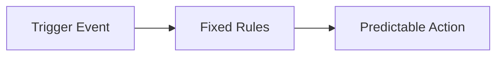
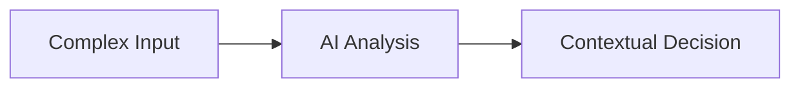
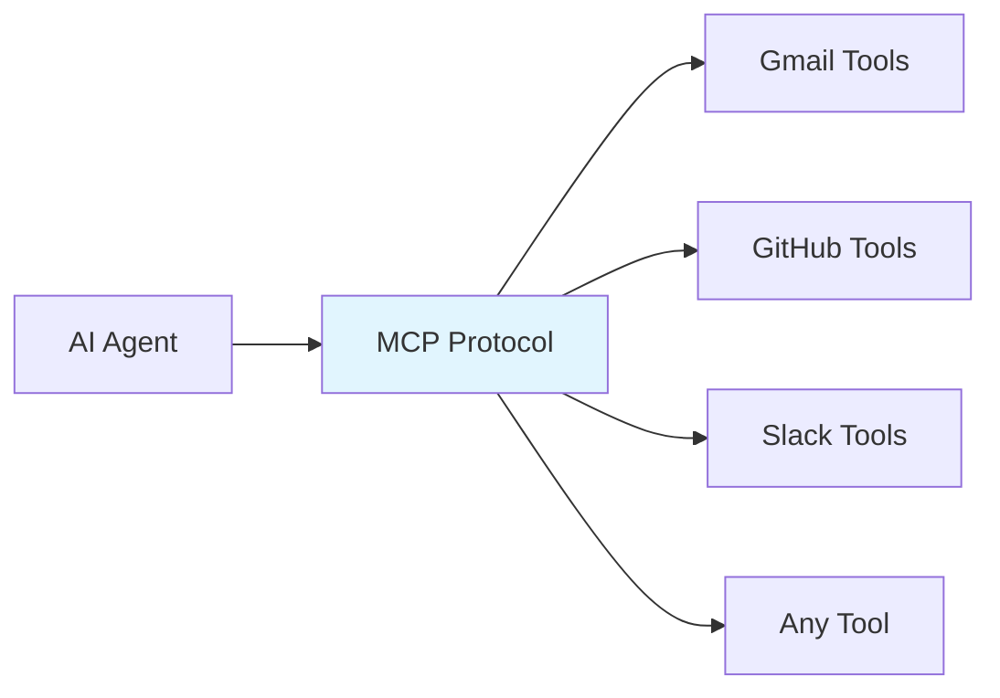
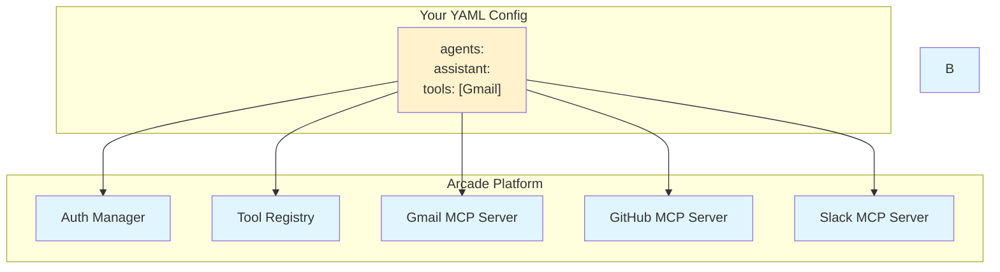

# AI Agent Building Workshop - Presentation Slides

---

## Slide 1: Workshop Title

# Death to AI Infrastructure
## How YAML + Arcade Killed Agent Complexity

**The Future of Agent Development:**
- **Zero Infrastructure Setup**
- **Declarative Configuration**  
- **Production-Ready from Day 1**

*Building AI agents should be as easy as writing a YAML file*

---

## Slide 2: The Big Revelation

# AI Agents Are Just...

## **Prompts + Tools**

```yaml
agents:
  assistant:
    instructions: "You are a helpful assistant"  # ← The Prompt
    tools: [Gmail, GitHub, Slack]                # ← The Tools
```

**That's it.** Everything else is just infrastructure complexity.

---

## Slide 3: The Traditional Pain

# Before: The Developer's Nightmare

```python
# Just to send an email... 😤
class EmailAgent:
    def __init__(self):
        self.setup_oauth()           # 50 lines
        self.create_gmail_client()   # 30 lines  
        self.handle_auth_refresh()   # 40 lines
        self.define_tool_schemas()   # 60 lines
        self.implement_error_handling() # 70 lines
        
    # ... 200+ more lines just for Gmail
```

**× Multiply by every tool you want to use**  
**× Multiply by every authentication provider**  
**× Multiply by maintenance overhead**

---

## Slide 4: The YAML Revolution

```yaml
agents:
  email_assistant:
    instructions: Send and manage emails professionally
    tools: [Gmail]
```

## **That's 3 lines for a production Gmail agent.**

✅ Authentication: **Handled by Arcade**  
✅ API Integration: **Handled by Arcade**  
✅ Error Handling: **Handled by Arcade**  
✅ Rate Limiting: **Handled by Arcade**  
✅ Token Refresh: **Handled by Arcade**

---

## Slide 5: Workflow Types - The Critical Distinction

# Deterministic vs Non-Deterministic Agent Workflows

## **Deterministic Workflows**

- **Predictable**: Same input → Same output
- **Rule-based**: Follow explicit business logic
- **Auditable**: Clear compliance trail

## **Non-Deterministic Workflows**  

- **Adaptive**: Context-aware reasoning
- **Intelligent**: Handle ambiguity and edge cases
- **Learning**: Improve from experience

---

## Slide 6: Deterministic Workflow Example

# When Rules Are King

```yaml
# Your existing inventory system already monitors levels
# AI agent provides intelligent purchasing decisions
agents:
  purchasing_advisor:
    instructions: |
      When called with low stock data, provide recommendations:
      → Analyze demand patterns and seasonality
      → Compare vendor pricing and reliability
      → Calculate optimal reorder quantities
      → Return specific purchase recommendations
    tools: [SupplierAPI, MarketData, BudgetAPI]
```

**Integration Pattern:**
- 🏭 **Existing system** monitors levels (deterministic)
- 🤖 **AI agent** provides intelligent recommendations  
- ⚡ **Simple integration** via API call
- 📈 **Enhanced decisions** without replacing infrastructure

**Why This Works:**
- 🔧 **No infrastructure changes** needed
- 🎯 **Keep existing reliability** of monitoring
- 💡 **Add intelligence** only where needed
- 📊 **Maintain audit trails** from existing systems

---

## Slide 7: Non-Deterministic Workflow Example

# When Intelligence Matters

```yaml
# Customer Support - Non-Deterministic
agents:
  support_agent:
    instructions: |
      Analyze customer inquiry considering:
      - Customer history and sentiment
      - Product knowledge base  
      - Current system status
      - Previous interaction patterns
      
      Craft personalized response and determine escalation needs.
```

**Perfect for:**
- ✅ Customer interactions
- ✅ Content creation
- ✅ Complex problem solving
- ✅ Personalized experiences

**Characteristics:**
- 🧠 **Intelligent**: Contextual reasoning
- 🎨 **Creative**: Variable responses
- 📈 **Adaptive**: Learn from patterns

---

## Slide 8: Hybrid Workflows - Best of Both Worlds

# The Production Reality

```yaml
# Your existing systems + AI intelligence  
agents:
  smart_purchasing_agent:
    instructions: |
      When called by inventory systems with low stock alerts, 
      I provide intelligent purchasing recommendations by analyzing:
      - Seasonal demand forecasts and trends
      - Supplier performance history & current pricing
      - Budget constraints and cash flow
      - Market conditions and supply chain status
      
      Return specific actionable recommendations.
    tools: [SupplierAPI, MarketData, FinanceAPI, ForecastAPI]
```

**The Integration Pattern:**
**Your Existing System** → **Calls Simple AI Agent** → **Gets Intelligent Recommendations**

---

## Slide 9: Ambient Agents - Always-On Intelligence

# Background Intelligence

```yaml
# Your monitoring system calls this when alerts trigger
agents:
  incident_response_agent:
    instructions: |
      When called with system alerts and performance data, I analyze:
      - Alert severity and potential impact scope
      - Historical patterns for similar incidents  
      - Current team availability and expertise
      - Recommended resolution steps and escalation path
      
      Provide intelligent incident response recommendations.
    tools: [MonitoringAPI, PagerDuty, Slack, KnowledgeBase]
```

**Integration with Existing Systems:**
-

---

## Slide 10: Real-World Workflow Patterns

# Patterns You'll See in Sample Agents

## **Pattern 1: Single Specialist**
```bash
Gmail Request → Simple Agent → Gmail Tools → Response
```
*Example: `simple-agent-example.yaml` - Gmail assistant*

## **Pattern 2: Multi-Agent Routing**
```bash
Complex Request → Supervisor → Specialist Agent → Tools → Response
```
*Example: `supervisor-personal-assistant.yaml` - Email + Calendar + Docs*

## **Pattern 3: Hierarchical Departments**
```bash
Enterprise Request → Master Supervisor → Department Supervisor → 
Specialist Agent → Tools → Response
```
*Example: `hierarchical-agent-teams-example.yaml` - 3 departments*

---

## Slide 11: What is MCP?

# Model Context Protocol (MCP)
## "USB-C for AI Applications"



**MCP Provides:**
- 🔌 **Standardized Connection** between AI and tools
- 🔄 **Interoperability** across different applications  
- 🔒 **Security** with proper auth patterns
- 🎯 **Discovery** of tool capabilities

*Reference: https://modelcontextprotocol.io/docs/getting-started/intro*

---

## Slide 12: MCP Architecture Deep Dive

# MCP in Action



**Your job:** Write YAML  
**Arcade's job:** Everything else

---

## Slide 13: Arcade's Value Proposition

# What Arcade Handles For You

| **Without Arcade** | **With Arcade** |
|-------------------|----------------|
| 🔥 Set up OAuth flows | ✅ `tools: [Gmail]` |
| 🔥 Manage credentials | ✅ Handled automatically |
| 🔥 Build MCP servers | ✅ 100+ pre-built servers |
| 🔥 Handle rate limits | ✅ Built-in intelligence |
| 🔥 Deploy infrastructure | ✅ Cloud-hosted |
| 🔥 Maintain APIs | ✅ Always up-to-date |

**Result:** 95% less code, 100% more focus on your agent logic

---

## Slide 14: How main.py Works - The Engine Deep Dive

# Understanding the Architecture

## **The YAML → Agent Pipeline:**
```python
# 1. Configuration Loading
with open('agents.yaml', 'r') as f:
    config = yaml.safe_load(f)

# 2. Arcade Tool Discovery
toolkits = extract_toolkits_from_config(config)
tool_manager = ToolManager(arcade_client)
langchain_tools = tool_manager.to_langchain(use_interrupts=True)

# 3. Agent Creation  
for agent_id, agent_config in config['agents'].items():
    agent = create_react_agent(llm, tools, prompt)
    
# 4. LangGraph Routing System
workflow = StateGraph(YAMLAgentState)
workflow = build_routing_logic(agents, config)

# 5. Request Processing
response = await graph.ainvoke(user_request)
```

**Key Innovation:** Automatic routing graph generation from YAML instructions

---

## Slide 15: Custom Tools & MCP Servers - Extending the Platform

# Build Your Own Intelligence Layer

## **Custom MCP Server Development**
```python
# Create your custom business logic
class CustomMCPServer:
    @tool
    def analyze_sales_data(self, period: str) -> str:
        """Custom business intelligence for your company"""
        return custom_analysis_logic(period)
    
    @tool  
    def execute_proprietary_workflow(self, params: dict) -> str:
        """Your unique business process automation"""
        return execute_custom_workflow(params)

# Deploy to Arcade platform
arcade.deploy_mcp_server(custom_server)
```

## **Automatic Agent Integration**
```yaml
# Your agents automatically discover new tools
agents:
  business_analyst:
    instructions: Use all available analysis tools for insights
    tools: [CustomAnalytics, Salesforce, GoogleSheets]
```

**Game Changer:** Tools become instantly available across all agents

---

## Slide 16: Tools Becoming Agents - The Next Evolution

# The Future: Intelligent Tools

## **Traditional Tools vs Agent-Tools**

**Traditional Tool:**
```python
def send_email(to: str, subject: str, body: str) -> str:
    """Send email with exact parameters"""
    return gmail_api.send(to, subject, body)
```

**Agent-Tool (Arcade's Direction):**
```python
def intelligent_communication(intent: str, context: dict) -> str:
    """AI agent that handles communication intelligently"""
    # Determines if email, Slack, or Teams is best
    # Crafts appropriate message tone and format
    # Handles follow-ups and scheduling autonomously
    return ai_communication_agent.process(intent, context)
```

## **What This Means:**
- 🧠 **Tools reason about their usage**
- 🎯 **Context-aware execution**
- 🔄 **Self-improving capabilities**
- 🤝 **Agent-to-agent collaboration**

---

## Slide 17: Live Demo Setup

# Let's Explore a Real Agent System!

## **Example:** IT Helpdesk System  
*(from `agents/single-supervisor-agents/supervisor-it-helpdesk.yaml`)*

**How it works:**
- Handle ticket queries → Check Jira status
- Answer questions → Search knowledge base  
- Escalate issues → Create tickets & notify teams

**Tools Used:**
- Jira (ticket management)
- SharePoint (knowledge base)
- Outlook & Teams (notifications)

**Let's see it in action!** 🚀

---

## Slide 18: Demo - See it in Action

# Test the Real IT Helpdesk System

```bash
$ python main.py agents/single-supervisor-agents/supervisor-it-helpdesk.yaml "What's the status of ticket HELP-123?"

🎫 Routing to ticket agent...
🔍 Checking Jira for ticket HELP-123...
📋 Ticket HELP-123: "WiFi connectivity issues"
   Status: In Progress | Assigned: John Smith
✅ Last updated 2 hours ago with resolution steps
```

```bash
$ python main.py agents/single-supervisor-agents/supervisor-it-helpdesk.yaml "My laptop won't connect to WiFi, need help"

📚 Routing to knowledge agent...
🔍 Searching SharePoint documentation...
💡 Found WiFi troubleshooting guide with 5 steps
🆘 Routing to escalation agent...
🎫 Created ticket HELP-124 and notified IT team via Teams
```

**Real agents, real tools, real workflows!**

---

## Slide 19: The OAuth Flow

# Authorization Made Simple

```bash
$ python main.py agents/simple-agents/simple-agent-example.yaml "Send email to team"

🔒 Authorization required: https://accounts.google.com/oauth/...
Please complete authorization in your browser, then type 'continue'
```

**What happens behind the scenes:**
1. 🔐 Arcade detects missing authorization
2. 🌐 Generates secure OAuth URL
3. ⏸️ Pauses execution gracefully  
4. ✅ User completes auth in browser
5. 🔄 Types 'continue' to resume
6. 🚀 Request proceeds with proper credentials

**No OAuth implementation needed on your side!**

---

## Slide 20: Debug Mode Power

# Understanding Your Agents

```bash  
python main.py --debug agents/single-supervisor-agents/supervisor-it-helpdesk.yaml "Create a ticket for WiFi issues"

[DEBUG] Loading config: supervisor-it-helpdesk.yaml
[DEBUG] Discovered toolkits: Jira, Sharepoint, OutlookMail, MicrosoftTeams
[DEBUG] Creating agents: ticket, knowledge, escalation, supervisor
[DEBUG] Building routing graph with supervisor: supervisor
[DEBUG] Processing: "Create a ticket for WiFi issues"
[DEBUG] supervisor -> routing to escalation (ticket creation task)
[DEBUG] escalation -> using Jira tool: CreateIssue
[DEBUG] escalation -> using MicrosoftTeams tool: SendMessage
[DEBUG] Tool execution successful
```

**Perfect for:**
- 🐛 Debugging routing logic
- 📊 Understanding tool usage
- 🔍 Tracing request flow
- ⚡ Optimizing performance

---

## Slide 21: Production Considerations

# Ready for Production

## **Configuration Management**
```yaml
agents:
  support_agent:
    model: gpt-4o              # Production model
    temperature: 0.3           # Consistent responses
    instructions: |
      {{company_guidelines}}   # External content
    tools:
      - toolkit: Zendesk
        tools: [GetTicket, UpdateTicket]  # Specific permissions
```

## **Monitoring & Observability**
- 📊 **LangSmith integration** for tracing
- 📝 **Comprehensive logging** with debug mode
- 🚦 **Rate limiting** handled by Arcade
- 🔄 **Automatic retries** for failed requests

---

## Slide 22: Today's Complete Workshop Journey

# What You'll Build

## **Phase 1: Foundation & Exploration**
- Agent fundamentals: Prompts + Tools + Workflow Integration
- MCP and Arcade architecture deep dive
- main.py technical walkthrough
- Run sample agents from `agents/` directory
- Understand custom tool development and intelligent tools

## **Phase 2: Design & Build**
- Design your own agents on paper for your use case
- Build custom YAML agents from your design
- Test and iterate with real tools
- Debug and optimize agent behavior

## **Phase 3: Production Ready**
- Production deployment patterns
- Integration planning with existing systems
- Scaling and monitoring strategies
- Custom MCP server development planning

## **Phase 4:** Q&A and Next Steps

---

## Slide 23: Questions & Discussion

# Let's Build the Future Together

## **Key Questions to Explore:**

🤔 **"What agent would solve your biggest daily pain point?"**

🎯 **"How could your organization benefit from hierarchical agents?"**

🔧 **"What custom tools would you build for your business?"**

📈 **"Where do you see intelligent tools heading?"**

## **Interactive Discussion:**
- Share your use cases
- Discuss implementation challenges
- Plan your custom MCP server development
- Design your agent architecture

**Remember:** AI agents are just prompts + tools.  
**The hard part should be the prompts, not the tools.**

---

## Slide 24: Workshop Kickoff  

# Let's Get Building! 🚀

## **Setup Checklist:**
- [ ] Environment configured (`pip install -r requirements.txt`)
- [ ] API keys ready (OpenAI, Arcade)
- [ ] Repository cloned and accessible
- [ ] Debug mode understood (`--debug` flag)

## **First: Explore Sample Agents**
```bash
# Start simple: Single Gmail assistant
python main.py agents/simple-agents/simple-agent-example.yaml "Check my recent emails"

# Multi-agent: Personal assistant with routing
python main.py agents/single-supervisor-agents/supervisor-personal-assistant.yaml "Schedule a meeting and create a document"

# Enterprise: Multi-department system
python main.py agents/hierarchical-multi-supervisor-agents/hierarchical-agent-teams-example.yaml "Check calendar and create GitHub issue"
```

**Goal:** See real agent patterns in action, then design your own!

---

## Slide 25: Troubleshooting Guide

# Common Issues & Solutions

## **"Authorization Required" Messages**
```bash
🔒 Authorization required: https://accounts.google.com/...
```
**Solution:** Complete OAuth flow, type `continue`

## **Agent Not Routing Correctly**  
**Problem:** Vague routing instructions
**Solution:** Be explicit about routing criteria
```yaml
supervisor:
  instructions: |
    Route based on these EXACT criteria:
    - If message contains "email" → email_agent
    - If message contains "calendar" → calendar_agent  
```

## **Max Iterations Exceeded**
**Problem:** Agents stuck in routing loops
**Solution:** Add clear completion criteria
```yaml
routing:
  max_iterations: 10  # Prevent infinite loops
```

## **Tools Not Found**
**Problem:** Toolkit name mismatch
**Solution:** Check exact toolkit names in Arcade documentation

## **Debug Mode Tips**
- Use `--debug` to see routing decisions
- Check tool discovery process
- Monitor LangGraph execution flow

---

*End of Slides - Begin Hands-On Workshop*